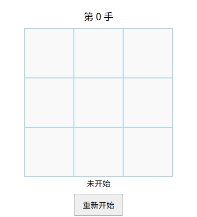
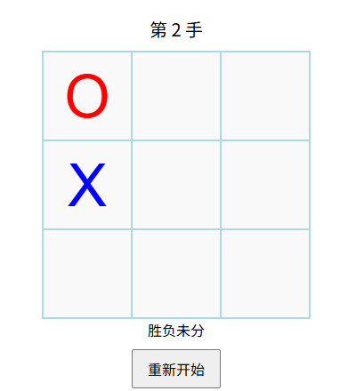
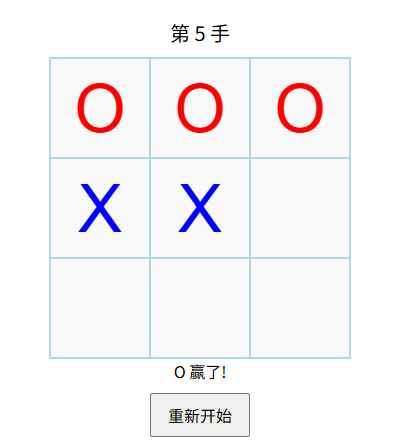
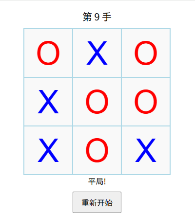

# 🎮 Tic Tac Toe (井字棋)

## 📌 项目简介
一个使用 **HTML、CSS、JavaScript** 编写的简易3 x 3井字棋小游戏。玩家轮流点击棋盘格子，分别使用 **O** 和 **X** 作为棋子，直到一方获胜或平局。

---

## 🎯 游戏规则
- 玩家轮流点击棋盘格子。  
- **O** 先手，**X** 后手。  
- 连成一条直线（横、竖、斜）即获胜。  
- 如果 9 步走完仍无胜者，则判定为 **平局**。  

---

## 🛠️ 技术栈
- **HTML5**：语义化标签，页面结构设计
- **CSS3**：Flexbox 布局，样式美化，交互效果 
- **JavaScript (ES6+)**：DOM 操作实现动态更新棋盘与游戏状态提示，事件监听，游戏逻辑实现，包括落子、胜负判定、平局检测。
- **Git & GitHub Pages**：项目部署，可在线试玩
---

## 🚀 项目链接
- [**在线试玩**](https://salzfisch.github.io/Tic-Tac-Toe-JS/)

---

## 📂 文件结构
```
TIC-TAC-TOE/
├── src/
│   ├── index.js           # 游戏逻辑脚本
│   └── style.css          # 样式文件
├── img/
│   ├── icon.png           # 图标资源
│   ├── screenshot1.png    # 游戏初始截图1
│   ├── screenshot2.png    # 游戏过程截图2
│   ├── screenshot3.png    # 游戏胜利截图3
│   └── screenshot4.png    # 游戏平局截图4
├── index.html             # 主页面入口
└── README.md              # 项目说明文档
```

---

## 📸 游戏截图




---


## 📜 License
本项目仅供学习与练习使用。
